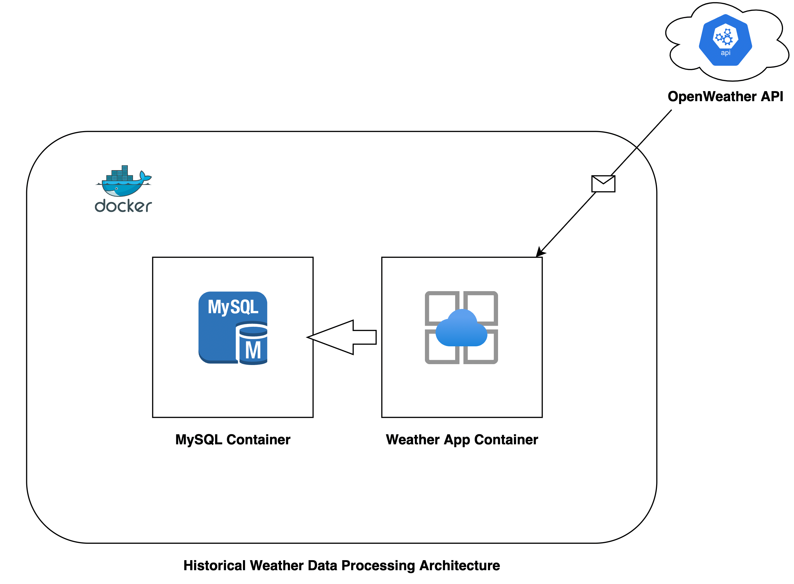
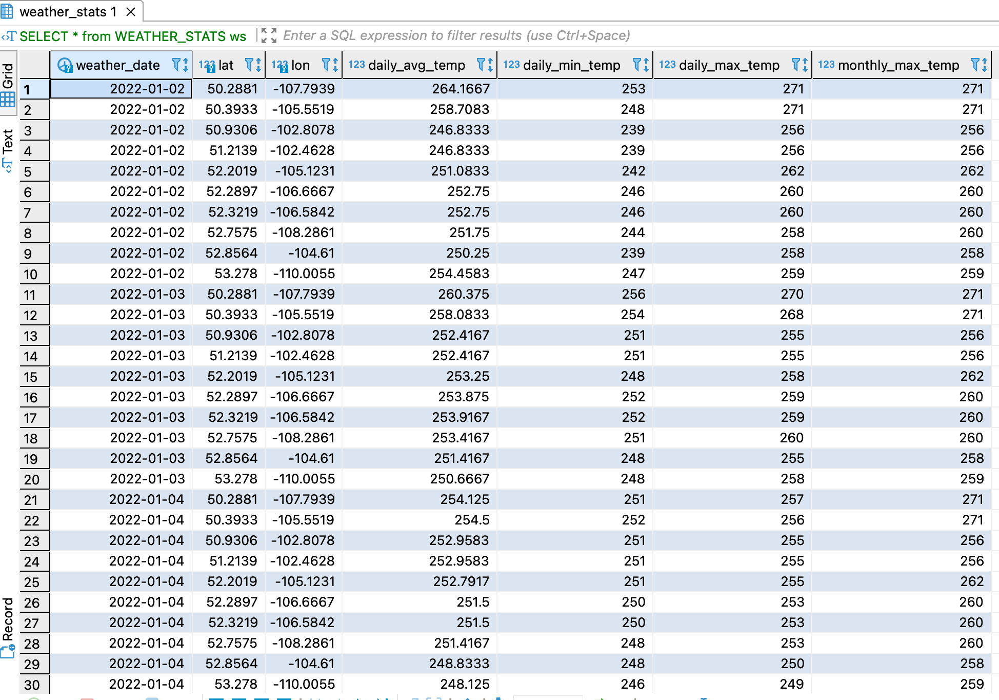

# Weather API

## Overview
Weather App pulls the historical weather data for provided locations. In our
case, we are pulling data for below locations for past __*5 days*__.

| Latitude  | Longitude  | City  |
|---|---|---|
|  51.213890 | -102.462776  | Yorkton-SK-Canada  |
| 52.321945  |  -106.584167 | Warman-SK-Canada  |
| 50.288055  |  -107.793892 |  Swift Current-SK-Canada |
| 52.757500  | -108.286110  | North Battleford-SK-Canada  |
| 50.393333  | -105.551941  | Moose Jaw-SK-Canada  |
| 50.930557  |  -102.807777 |  Melville-SK-Canada |
| 52.856388  | -104.610001  |  Melfort-SK-Canada |
| 52.289722  |  -106.666664 |  Martensville-SK-Canada |
| 52.201942  | -105.123055  | Humboldt-SK-Canada  |
| 53.278046  | -110.005470  | Lloydminster-SK-Canada  |

For fetching the data, we are using http://api.openweathermap.org/data/2.5/onecall/timemachine?lat=60.99&lon=30.9&dt=1586468027&appid={APIkey} 
 API url exposed by OpenWeather organization.

Weather app is wrapped or encapsulated inside a docker-compose as a services such as
__*weather_db*__ and __*weather_app*__. 

## Services

### weather_db
As a part of this service, MySQL database server is running. When docker-compose
bootstrap the service, it will create __*WEATHER*__ database and few tables
where app service will store the weather data.

#### Tables
- __*DAILY_WEATHER*__ table stores weather data on date basis.
- __*HOURLY_WEATHER*__ table stores weather data on hourly basis.
- __*WEATHER_STATS*__ table stores the statistics data calculated by application.

you can find all the DDL's [./data/sqls/init.sql](./data/sqls/init.sql) here.

### weather_app
Service is a python application which polls the weather data from OpenWeather API and stores into MySQL tables. 
It wills also calculate the stats about weather and persist the same as well.

## Setup Weather App
Docker-compose uses the docker images in order to spin up the services.
For make this happens, we have follow below steps:
- Create weather_app:1.0 docker image using below command. Make sure Dockerfile should be available in your current directory.
>   docker build -t weather_app:1.0 .
- Update OpenWeather API key in docker-compose.yaml file under __*environments*__ section for __*weather_app*__ service.
- Next, we have run __docker-compose up__ command to start the services.

## Weather App Execution Flow
Once the services started as a part of docker-compose, it will create
2 folder in the project root directory
- __*.mysql-data*__ which stores MySQL database data
- __*.log*__ which stores application log files which rolled every day and keep logs 
data for last 5 days.

At the time of __*weather_app*__ service bootstrapping I have put 60 seconds pause due to its dependency on MySQL server which eventually takes some time 
before it is ready to accept connections.

Next, application reads configuration file [config](./config) folder to adjust 
its behaviour according to mentioned configurations.

Secondly, it starts polling weather data from OpenWeather API for provided location
which you find [config/locations.yaml](./config/locations.yaml)

Once the weather data pulled successfully then application structure and split data on daily and hourly 
basis separately and store in their respective tables in __*WEATHER*__ databadse.

Lastly, weather app uses the hourly data to find the answers for the following questions:

- What is the minimum temperature per day for a particular location?
- What is the average temperature per day for a particular location?
- What is the maximum temperature per month for a particular location?

Once above questions are answered then it stores the final output in __*WEATHER_STATS*__ table.

